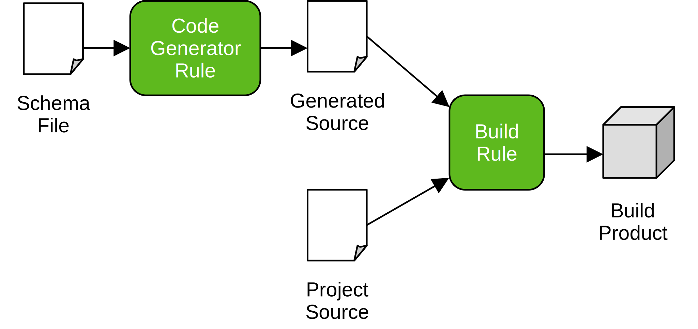

# Python code generators

## Background

It is possible to create a _code generator_ Bazel Rule that acts as a `py_library`. The Bazel Action setup by the code generator Rule would execute a tool that outputs Python source code. A `py_binary` is then configured with the code generator Rule instance as a dependency and uses the generated source code. 

The following diagram shows how a code generator might look like in a typical scenario where code is generated from the structures present in a schema.



## Example

See the Python example [simple_code_generator](/examples/python/simple_code_generator).

## Intelli-J

The Bazel Intelli-J plugin is able to work with generated Python code in this situation. You need to ensure that your code generator has no `srcs` attribute and that it has a tag `intellij-py-code-generator`. This tag signals to the plugin that the Rule's output is generated code.

During a full sync, the plugin will need to execute an additional Bazel `query` in order to locate rules with the tag. This is an unavoidable overhead of this approach and so that the cost of this is only borne by projects that require it, there is a setting to enable it. You will find the file to add the setting in the `.ijwb` directory in your project files. Inside this directory is a file with extension `.bazelproject`; add the following line into this file.

```
enable_python_codegen_support: true
```


